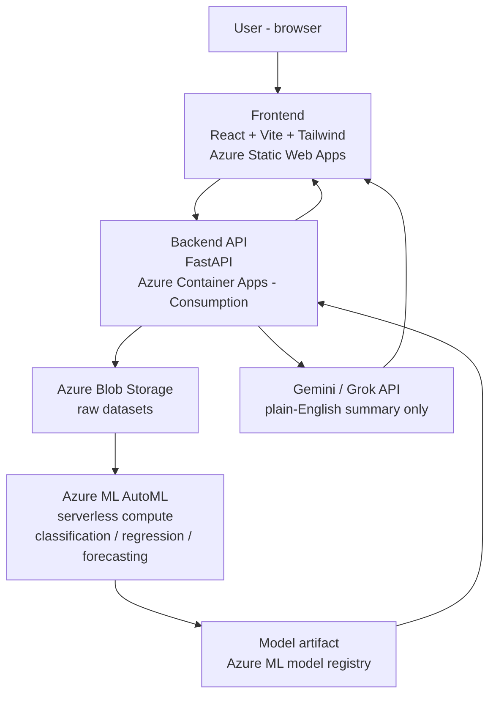

# Product Requirements Document — AutoML Forge

*(working name — rename freely, used as a placeholder throughout this doc)*

---

## 1. Problem statement

Building a classical machine learning model today — even a simple one — means manually trying multiple algorithms, tuning hyperparameters, comparing metrics, and wiring up a way to serve predictions. That's slow, repetitive, and requires ML expertise most people don't have time to build up for a one-off problem.

**AutoML Forge** removes all of that friction. A user uploads a CSV, points at the column they want to predict, and the platform automatically trains, compares, and explains dozens of models — then instantly exposes the winning model as a live, usable prediction endpoint. No notebook, no manual tuning, no deployment step. Upload to live prediction, end to end, with nothing done by hand.

**Primary audience:** recruiters/interviewers reviewing this as a live portfolio project — they should be able to open the link and *experience* the pipeline running, not just read about it.
**Secondary audience:** anyone who wants a quick, explainable classical ML model without setting up any infrastructure themselves.

---

## 2. Goals

- Fully automated pipeline: upload → validate → train → compare → explain → predict, zero manual steps
- Cost-efficient: must run indefinitely on free tiers + the existing $100 Azure student credit, without recurring spend for idle time
- Scalable by design: architecture uses serverless/consumption compute throughout, so a traffic spike doesn't require a redesign
- Reliable: predictable behavior under bad input, job timeouts, and cold starts
- Professional, clean, mobile-responsive frontend — this is a portfolio piece, it has to look the part on a phone as much as a laptop

## 3. Non-goals (v1)

- No user accounts, login, or saved history — every session is anonymous and stateless
- No deep learning / neural networks — this is a classical ML project by design
- No image, audio, or unstructured text datasets — tabular and time-series only
- No multi-tenant / enterprise features (teams, billing, roles)

---

## 4. Locked scope

| Decision | Locked choice |
|---|---|
| Accounts | None — fully anonymous, nothing persisted per user |
| ML task types | Classification, Regression, **and Time-series Forecasting** |
| Feature set | Full set — all must-have and stretch features included |
| LLM usage | Narration only (result summaries) — never used for predictions |

---

## 5. Features

### 5.1 Must-have

| Feature | Description |
|---|---|
| CSV upload + demo datasets | Upload your own file, or one-click try a preloaded Kaggle dataset (one each for classification, regression, forecasting) |
| Auto schema detection | Detects column types, suggests the target column and task type, lets the user override |
| Pre-training data health check | Flags missing values, class imbalance, and type mismatches before training starts |
| AutoML training (Azure ML, serverless compute) | Trains and compares classical algorithms automatically for the chosen task type |
| Live training race view | Real-time progress per algorithm while training runs, not a blank spinner |
| Model leaderboard | Ranked comparison of every trained model against the chosen metric |
| Plain-English AI summary | One LLM call (Gemini/Grok) turns the leaderboard + top features into a short human-readable explanation |
| What-if prediction playground | Live sliders/inputs — change a value, see the prediction update instantly |
| Feature importance / explainability | Shows which inputs drove a given prediction (SHAP-style) |
| Mobile-responsive, professional UI | Fully usable on a phone, not just a scaled-down desktop layout |

### 5.2 Extra / stretch

| Feature | Description |
|---|---|
| Model comparison chart | Visual (radar/bar) comparison across all trained models |
| Copy-paste live API | A working curl/Python snippet hitting the trained model's own prediction endpoint |
| Export as Python code | Generates the equivalent scikit-learn script for the winning model |

---

## 6. High-level design (HLD)



**Components:**

- **Frontend** — React SPA, statically hosted, free regardless of traffic.
- **Backend API** — the only stateful-ish piece, and even that's minimal (see §7.4). Orchestrates every step: upload, job submission, polling, serving predictions.
- **Blob Storage** — holds uploaded CSVs and the preloaded demo datasets. Pennies/month regardless of use.
- **Azure ML AutoML** — does the actual machine learning. Runs on serverless compute, so nothing is provisioned or billed between jobs.
- **Model registry** — the winning model's artifact lives here after training; the backend downloads and caches it for serving.
- **LLM call** — a single, short call per completed job. Not on the prediction path at all.

**CI/CD:** GitHub → GitHub Actions → parallel deploy to Static Web Apps (frontend) and Container Apps (backend). Monorepo, one workflow file.

---

## 7. Low-level design (LLD)

### 7.1 API endpoints

```
POST   /api/datasets/upload           multipart CSV upload → dataset_id, detected schema
GET    /api/datasets/demo             list of preloaded demo datasets
POST   /api/datasets/{id}/validate    returns data health check report

POST   /api/training/jobs             submit an AutoML job → job_id
GET    /api/training/jobs/{id}/status running/completed/failed + per-trial progress
GET    /api/training/jobs/{id}/leaderboard   ranked models + metrics
GET    /api/training/jobs/{id}/summary       plain-English LLM narration (cached after first call)
GET    /api/training/jobs/{id}/explain       feature importance data

POST   /api/predict/{job_id}          live prediction from user-supplied feature values
GET    /api/predict/{job_id}/code     exported scikit-learn script
GET    /api/predict/{job_id}/curl     copy-paste API snippet
```

### 7.2 Training job submission (request body)

```json
{
  "dataset_id": "string",
  "task_type": "classification | regression | forecasting",
  "target_column": "string",
  "time_column": "string (forecasting only)",
  "forecast_horizon": "int (forecasting only)",
  "primary_metric": "string (optional override, sensible default per task)"
}
```

### 7.3 Azure ML AutoML job config (conceptual)

```python
job = automl.classification(   # or .regression / .forecasting
    training_data=blob_uri,
    target_column_name=target_column,
    primary_metric="accuracy",   # sensible default per task
    compute="serverless",        # no cluster to manage
)
job.set_limits(
    timeout_minutes=15,          # caps cost + keeps demo snappy
    trial_timeout_minutes=5,
    enable_early_termination=True,
)
```
For forecasting jobs: also set `forecasting_settings(time_column_name=..., forecast_horizon=...)`.

### 7.4 State — no database needed

Because v1 is anonymous and stateless, job status doesn't need its own database — the backend just proxies Azure ML's own job-status API using the `job_id`. Model artifacts are fetched from Azure ML's model registry, loaded once, and cached in memory (LRU, keyed by `job_id`) for serving predictions. Datasets live in Blob Storage.

Trade-off: if the backend container scales to zero and a user comes back to an old `job_id`, the model needs a quick re-fetch/reload — a few seconds of one-time latency, acceptable for a demo tool.

### 7.5 Guardrails (public + anonymous = needs limits)

- Max upload size (e.g. 10 MB)
- Rate limit per IP (uploads and training jobs per hour)
- Hard job timeout (15 min) — bounds Azure ML spend per job
- Input validation: reject missing target column, empty datasets, unsupported types

---

## 8. Technical flow (user journey)

1. User lands on the homepage → picks a demo dataset or uploads their own CSV
2. Backend validates the file, runs the data health check, detects schema, suggests target column + task type
3. User confirms/adjusts target column and task type → clicks Train
4. Backend submits an AutoML job to Azure ML on serverless compute
5. Frontend polls job status → renders the live training race view
6. On completion, backend fetches the leaderboard and downloads the winning model artifact
7. Backend calls the LLM once with the metrics + top features → gets the plain-English summary
8. Frontend shows: leaderboard, plain-English summary, feature importance, what-if playground, API snippet, export-code button
9. User types feature values → live predictions served directly from the already-loaded model (no extra Azure ML cost per prediction)

---

## 9. Tech stack

| Layer | Choice |
|---|---|
| Frontend | React + Vite + Tailwind CSS |
| Frontend hosting | Azure Static Web Apps |
| Backend | FastAPI (Python) |
| Backend hosting | Azure Container Apps — Consumption plan |
| Training | Azure ML AutoML, serverless compute (CPU only — no GPU needed for tabular data) |
| Dataset storage | Azure Blob Storage |
| Model serving | Downloaded model artifact, cached in-memory in the backend |
| Narration | Gemini or Grok (free API tier) |
| CI/CD | GitHub Actions, monorepo |

---

## 10. Non-functional requirements

- **Cost:** stays within Azure's free consumption grants + serverless training cost per job; no resource billed while idle
- **Scalability:** consumption-based compute at every layer means it scales out automatically under load, and back to zero at rest
- **Reliability:** job timeouts, input validation, and graceful failure states (a failed training job shows a clear reason, not a blank screen)
- **Performance:** frontend loads in under 2 seconds; predictions return in under 1 second once a model is loaded
- **Responsiveness:** usable down to a 360px-wide mobile screen, not just a shrunk desktop layout
- **Security-lite:** no accounts, so no auth surface — guardrails focus entirely on abuse prevention (rate limits, size caps, timeouts)

---

## 11. Cost model

| Component | Expected cost |
|---|---|
| Frontend hosting | ₹0 — free tier |
| Backend hosting | ~₹0 for occasional traffic — Container Apps free monthly grant covers light, bursty use |
| Blob Storage | Pennies/month for a handful of CSVs |
| AutoML training | Only real recurring cost — scoped down by the 15-minute job timeout |
| LLM narration | ₹0 — free API tier |

Overall: should run for a full semester of demo use without meaningfully denting the $100 credit.

---

## 12. Risks & mitigations

| Risk | Mitigation |
|---|---|
| Public, anonymous access gets abused (spam uploads/jobs) | Rate limiting per IP, file size caps, job timeouts |
| Cold start latency after scale-to-zero | Acceptable for a demo tool; revisit with `min-replicas: 1` only if it becomes a real problem |
| A training job runs too long for a live demo | Hard 15-minute job timeout + early termination |
| Forecasting adds a distinct input shape (needs a time column + horizon) | Separate, clearly-labeled UI path when a forecasting dataset is selected |

---

## 13. Suggested build order

*(All features are in scope — this is a suggested sequence, not a cut list.)*

1. Core pipeline: upload, validate, submit AutoML job (classification + regression), leaderboard, basic prediction
2. Forecasting support (time column + horizon handling)
3. Wow layer: live training race, plain-English summary, what-if playground, explainability
4. Stretch features: comparison chart, API snippet, export-as-code
5. Polish pass: mobile responsiveness, visual design, CI/CD hardening

---

## 14. Open questions

- Final project name (placeholder used throughout: **AutoML Forge**)
- Exact demo datasets to preload (one classification, one regression, one forecasting — candidates TBD)
- Final pick between Gemini and Grok for the narration call
- Default primary metric per task type (accuracy for classification, RMSE for regression, MAPE for forecasting — confirm before locking)
