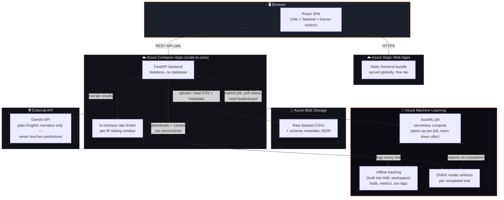
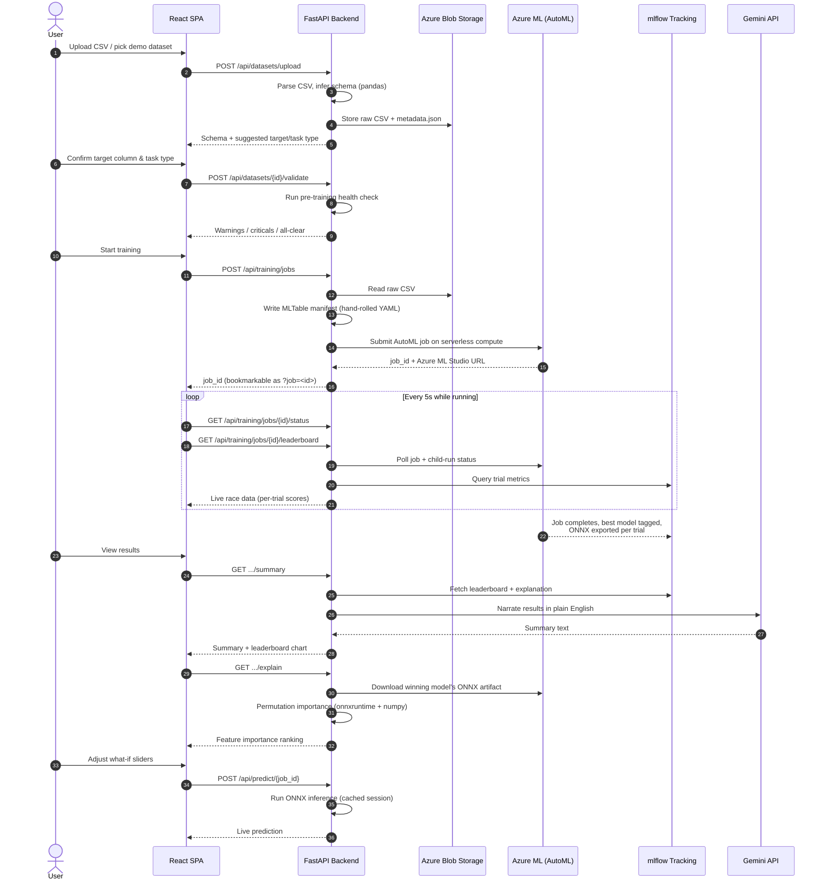

<div align="center">

# 🔥 AutoML Forge

**Upload a CSV. Walk away with a trained, explained, and live-servable ML model.**

No notebooks. No manual hyperparameter tuning. No deployment step. No accounts, no database, nothing saved except what Azure ML already keeps for you.

[](https://salmon-island-0c797df00.7.azurestaticapps.net)
[](https://github.com/Mudavath-Giri-Naik/AutoML-Forge/actions/workflows/deploy.yml)
[](https://www.python.org/)
[](https://react.dev/)
[](https://fastapi.tiangolo.com/)
[](https://azure.microsoft.com/en-us/products/machine-learning)

[**Live Demo**](https://salmon-island-0c797df00.7.azurestaticapps.net) · [Architecture](#-architecture) · [Tech Stack](#-tech-stack) · [Getting Started](#-getting-started) · [Roadmap](#-roadmap--future-scaling)

</div>

---

## What is this?

AutoML Forge is a full-stack, end-to-end AutoML platform. Point it at a CSV, tell it what column to predict, and it will:

1. Detect the schema and suggest a target column and task type
2. Run a pre-training data health check and flag problems before you waste compute on them
3. Submit an **Azure ML AutoML** job on **serverless compute** that trains and compares dozens of classical models
4. Stream the training race live — every trial, every algorithm, every score, as it happens
5. Rank the leaderboard, explain *why* the winning model makes the predictions it does (permutation importance — not a black box), and narrate the whole result in plain English via **Gemini**
6. Serve the winning model as a live prediction endpoint you can hit with `curl` or exported Python — no separate deployment step, ever
7. Remember every job you've trained (via Azure ML itself, not a database) so you can come back and test it on new data anytime

It's built as a **portfolio-grade** engineering project: anonymous by design (no accounts, no user data retained beyond what a training run needs), classical ML only (no deep learning — deliberately, see [design decisions](#-design-decisions--engineering-highlights)), and cost-conscious throughout (serverless/consumption pricing on every Azure resource it touches).

---

## ✨ Key Features

| | |
|---|---|
| 📊 **Smart schema detection** | Infers column types (numeric, categorical, datetime, identifier, text, boolean) and suggests a target column + task type from the data itself |
| 🩺 **Pre-training health check** | Flags missing values, class imbalance, too-few-rows, high-cardinality columns, and more — *before* you spend compute on a doomed run |
| 🚀 **Real AutoML, not a toy** | Full Azure ML AutoML job — dozens of trials across many classical algorithms (LightGBM, XGBoost, Random Forest, SVM, KNN, logistic/linear models, voting/stacking ensembles) |
| 📡 **Live training telemetry** | Polls the real Azure ML run every few seconds and renders a live "race" view — bars growing, trial counts ticking up, in real time, not a fake progress bar |
| 🏆 **Ranked leaderboard** | Every completed trial, ranked by your chosen primary metric, with the winning model highlighted |
| 🧠 **Real explainability** | Permutation importance computed against the actual served ONNX model — shows exactly which input columns drove the prediction, computed live, not precomputed |
| 💬 **Plain-English summaries** | Gemini narrates what happened and what mattered, in language a non-technical stakeholder can read |
| 🎛️ **What-if playground** | Live sliders/dropdowns per feature, hitting the real prediction endpoint on every change — test the model on data it's never seen, instantly |
| 🔌 **Instant prediction API** | Every trained model is immediately a live HTTP endpoint — copy-paste `curl`, or export a standalone Python scoring script |
| 🗂️ **Previously trained models gallery** | Every job you've ever trained is listed on the home page, read live from Azure ML — click one to jump straight back into its full results, no retraining |
| 🛡️ **Production guardrails** | Per-IP rate limiting on uploads and training submissions, upload size caps, 15-minute job timeouts |
| 🎨 **Polished, animated UI** | A proper SaaS-grade interface — not a Streamlit demo — with framer-motion animations, a live status feed, and full responsive design |

---

## 🏗️ Architecture

AutoML Forge deliberately has **no database**. Every piece of state the app needs — job configuration, training status, leaderboard, model artifacts — already lives inside Azure ML (as job tags and mlflow run data) or Azure Blob Storage (the raw dataset). The backend is a thin, stateless orchestration layer over Azure's own APIs.



**Why no database?** Azure ML already *is* a durable, queryable store of everything a training job produces — parent/child run hierarchy, per-trial metrics, tags, model artifacts. Re-implementing a slice of that in Postgres would mean keeping two sources of truth in sync for zero benefit. Job state is stashed as **Azure ML job tags** at submission time (dataset ID, task type, target column, primary metric) and read straight back via the job ID — the job ID *is* the primary key.

### End-to-end request flow



---

## 🧰 Tech Stack

Nothing below is filler — every entry is a real, deliberate choice, several with a war story behind them (see [Design Decisions](#-design-decisions--engineering-highlights)).

### Frontend

| Technology | Role |
|---|---|
| **React 19** | UI library |
| **Vite 8** | Dev server + build tool |
| **Tailwind CSS v4** | Styling — custom design tokens via `@theme`, no separate config file |
| **framer-motion 12** | Entrance animations, staggered card reveals, animated progress bars |
| **recharts** | Leaderboard and feature-importance bar charts |
| **axios** | HTTP client |
| **react-dropzone** | Drag-and-drop CSV upload |
| **react-router-dom** | Routing primitives |
| **lucide-react** | Icon set |
| **oxlint** | Fast Rust-based linter |

### Backend

| Technology | Role |
|---|---|
| **Python 3.11** | Runtime (pinned — see [why](#-design-decisions--engineering-highlights)) |
| **FastAPI** | API framework |
| **Uvicorn** | ASGI server |
| **Pydantic v2 / pydantic-settings** | Request validation + typed environment config |
| **pandas / numpy** | CSV parsing, schema inference, health checks, permutation importance |
| **scikit-learn** | Transitive dependency of the AutoML/mlflow stack |
| **onnxruntime + onnx** | Model *serving* — inference against exported ONNX graphs instead of unpickling sklearn models |
| **mlflow / mlflow-skinny** | Trial tracking — reading leaderboard, metrics, and run tags out of the Azure ML workspace's built-in tracking server |
| **azure-ai-ml (SDK v2)** | Submitting and polling AutoML jobs against the Azure ML workspace |
| **azure-identity** | `DefaultAzureCredential` — `az login` locally, managed identity in production, zero stored secrets |
| **azure-storage-blob** | Dataset persistence in production |
| **azureml-mlflow** | Bridges mlflow's tracking API to the Azure ML workspace's run history |
| **python-multipart** | CSV upload parsing |

### AI / ML

| Technology | Role |
|---|---|
| **Azure ML AutoML** | Trains and compares dozens of classical models per job (classification, regression, forecasting) |
| **Azure ML serverless compute** | Per-job compute that spins up and tears down automatically — nothing left running between jobs |
| **ONNX** | Model export/serving format — model-agnostic, no need to unpickle Azure's internal training-runtime classes |
| **Permutation importance** (hand-rolled) | Model-agnostic explainability — shuffle one feature at a time, measure prediction drift |
| **Google Gemini API** | Plain-English result narration only — raw `urllib` REST calls, no SDK, never touches predictions |

### Infrastructure & DevOps

| Technology | Role |
|---|---|
| **Azure Container Apps** | Backend hosting — Consumption plan, scales to zero when idle |
| **Azure Container Registry** | Backend Docker image storage |
| **Azure Static Web Apps** | Frontend hosting — free tier, global CDN |
| **Azure Blob Storage** | Dataset persistence (raw CSV + schema metadata JSON) |
| **Azure RBAC / Managed Identity** | System-assigned identity on the Container App for AcrPull + AML Contributor + Storage Blob Data Contributor — no stored credentials except the Gemini key |
| **Docker** | Backend containerization (`python:3.11-slim`, non-root user) |
| **GitHub Actions** | CI/CD — build + push image, update Container App, deploy static frontend, on every push to `main` |

---

## 📁 Project Structure

```
AutoML Forge/
├── backend/
│   ├── app/
│   │   ├── main.py                  # FastAPI app wiring, CORS, startup seeding
│   │   ├── config.py                # Typed settings from environment
│   │   ├── routers/
│   │   │   ├── datasets.py          # Upload, demo list, schema, health check
│   │   │   └── training.py          # Job submit/status/leaderboard/predict/explain
│   │   ├── services/
│   │   │   ├── storage.py           # Local disk ↔ Azure Blob abstraction
│   │   │   ├── dataset_service.py   # Upload orchestration, demo seeding
│   │   │   ├── schema_detection.py  # Column type inference, target suggestion
│   │   │   ├── health_check.py      # Pre-training data validation
│   │   │   ├── aml_client.py        # Azure ML workspace connection
│   │   │   ├── training_service.py  # Job submit, leaderboard, ONNX serving, explain
│   │   │   ├── llm_service.py       # Gemini plain-English summaries
│   │   │   ├── rate_limiter.py      # Per-IP sliding-window limits
│   │   │   └── demo_registry.py     # The 3 seed datasets
│   │   └── data/demo_datasets/      # Titanic, California housing, airline passengers
│   ├── Dockerfile
│   └── requirements.txt
├── frontend/
│   ├── src/
│   │   ├── pages/UploadFlowPage.jsx # The wizard: dataset → schema → health → training
│   │   ├── components/              # DatasetPicker, SchemaReview, HealthCheckReport,
│   │   │                            # TrainingRace, TrainingStatus, ResultsView,
│   │   │                            # WhatIfPlayground, RecentRuns, CodeSnippet, ...
│   │   └── api/                     # Thin axios wrappers per backend router
│   └── vite.config.js
├── .github/workflows/deploy.yml     # CI/CD: build, push, deploy on every push to main
├── AZURE_SETUP.md                   # Full copy-paste Azure resource provisioning checklist
└── PRD_AutoML_Platform.md           # Original product spec this was built from
```

---

## 🔍 Design Decisions & Engineering Highlights

The stuff that doesn't show up in a feature list but is where most of the actual engineering time went:

- **No database, on purpose.** Azure ML's job tags + mlflow tracking already durably store everything a job needs to be fully reconstructed from just its `job_id`. The "Previously trained models" gallery isn't reading from a table — it's a live `ml_client.jobs.list()` call against the workspace, filtered by the app's own tags.
- **ONNX over pickle.** AutoML's native model format needs Azure's internal `azureml-training-tabular` runtime to unpickle — a ~30-package dependency chain that caps out below Python 3.12 and has a native protobuf/onnx DLL conflict. Exporting to ONNX and serving with plain `onnxruntime` sidesteps all of it, at the cost of one `enable_onnx_compatible_models=True` flag on the training job.
- **Hand-rolled MLTable manifests.** The official `mltable` package pulls in `azureml-dataprep-native`, which has no wheel for newer Python. The MLTable format itself is just a small, documented YAML schema — writing it by hand removes an entire fragile dependency.
- **Permutation importance over SHAP/azureml-interpret.** Both are correct, heavier options. Permutation importance needs nothing beyond the `onnxruntime` session already loaded for serving predictions — shuffle a column, measure how much the output moves, repeat per feature.
- **Synchronous route handlers, on purpose.** Every backend route that touches Azure ML, mlflow, or onnxruntime is declared as a plain `def`, not `async def`. All of that work is blocking, synchronous I/O — under `async def` it would freeze FastAPI's single-threaded event loop for *every* concurrent request, including trivial ones, while one slow call (e.g. downloading a model for explainability) runs. Plain `def` handlers get dispatched to FastAPI's worker thread pool automatically.
- **Serverless compute for training, Consumption plan for hosting.** Nothing in this stack runs 24/7 except the ~$0.17/day Container Registry. AutoML compute spins up per-job and tears down after; the backend scales to zero when idle.
- **Rate limiting without infrastructure.** An in-memory per-IP sliding window is enough for a single-replica, low-traffic public demo — no Redis needed (see [Roadmap](#-roadmap--future-scaling) for what changes if that assumption stops holding).

---

## 🚀 Getting Started

### Prerequisites

- **Python 3.11** (see [why this version](#-design-decisions--engineering-highlights))
- **Node.js 18+**
- An **Azure subscription** (optional for local dev — dataset upload/schema/health-check work fully offline; only training needs Azure ML)

### Backend

```bash
cd backend
python -m venv .venv
.venv/Scripts/activate        # Windows; `source .venv/bin/activate` on macOS/Linux
pip install -r requirements.txt
python scripts/fetch_demo_datasets.py   # one-time: downloads the 3 seed datasets
cp .env.example .env                    # defaults to local disk storage, no Azure needed
uvicorn app.main:app --reload --port 8000
```

Runs at `http://localhost:8000` — interactive API docs at `/docs`.

**Training requires an Azure ML workspace.** Without one, everything up to the health check works fully locally; `/api/training/*` and `/api/predict/*` return a clear 503 explaining what's missing. To enable it:

```bash
az login
```

then fill in `backend/.env`:

```env
AZURE_ML_SUBSCRIPTION_ID=<your subscription id>
AZURE_ML_RESOURCE_GROUP=<your resource group>
AZURE_ML_WORKSPACE_NAME=<your AML workspace name>
```

See [`AZURE_SETUP.md`](AZURE_SETUP.md) for the full provisioning checklist.

### Frontend

```bash
cd frontend
npm install
cp .env.example .env
npm run dev
```

Runs at `http://localhost:5173`, talking to the backend at `VITE_API_BASE_URL`.

### Try it

1. Open the app and pick one of the 3 demo datasets (or drag in your own CSV)
2. Review the auto-detected schema — confirm or override the target column and task type
3. Run the health check and review any findings
4. Pick a primary metric (and forecast horizon, for forecasting) and start training
5. Watch the live race view as trials complete
6. Review the leaderboard, plain-English summary, feature importance, and what-if playground
7. Copy the `curl` snippet or exported Python script to use the model from your own code

Steps 4–7 need the Azure ML workspace configured above; step 5's summary needs `GEMINI_API_KEY` too. A completed job's results page is shareable at `?job=<job_id>` — this is a stateless app, so the job ID is your only handle back to it (or just revisit the home page — every job you've trained shows up in the gallery at the bottom).

---

## ☁️ Deployment

Fully automated via GitHub Actions on every push to `main` — see [`.github/workflows/deploy.yml`](.github/workflows/deploy.yml). It builds the backend's Docker image, pushes it to Azure Container Registry, updates the Container App, and deploys the frontend to Static Web Apps, all in one run.

The only manual step, ever, is the **one-time** Azure resource provisioning — full copy-paste `az` CLI checklist in [`AZURE_SETUP.md`](AZURE_SETUP.md), including the exact RBAC roles each identity needs and the region-availability gotchas for Azure for Students subscriptions.

**Live production:**
- Frontend: `https://salmon-island-0c797df00.7.azurestaticapps.net`
- Backend API: `https://automl-forge-backend.nicedesert-39fb2e21.centralindia.azurecontainerapps.io`

---

## 📡 API Reference

<details>
<summary><strong>Expand for the full endpoint list</strong></summary>

| Method | Endpoint | Purpose |
|---|---|---|
| `GET` | `/api/health` | Liveness check |
| `POST` | `/api/datasets/upload` | Upload a CSV, get back inferred schema |
| `GET` | `/api/datasets/demo` | List the 3 seed demo datasets |
| `GET` | `/api/datasets/{id}` | Fetch a dataset's schema metadata |
| `POST` | `/api/datasets/{id}/validate` | Run the pre-training health check |
| `POST` | `/api/training/jobs` | Submit an AutoML training job |
| `GET` | `/api/training/jobs` | List past jobs submitted through this app |
| `GET` | `/api/training/jobs/{id}/status` | Poll job status + trial count |
| `GET` | `/api/training/jobs/{id}/leaderboard` | Ranked leaderboard (works mid-training too) |
| `GET` | `/api/training/jobs/{id}/summary` | Gemini plain-English narration |
| `GET` | `/api/training/jobs/{id}/explain` | Permutation feature importance |
| `POST` | `/api/predict/{id}` | Live prediction against the winning model |
| `GET` | `/api/predict/{id}/curl` | Copy-paste `curl` snippet, pre-filled with sample values |
| `GET` | `/api/predict/{id}/code` | Standalone exported Python scoring script |

Full interactive docs (Swagger UI) are always available at `/docs` on a running backend.

</details>

---

## 🗺️ Roadmap / Future Scaling

Honest list of what this architecture is *not* yet built for, and how it'd get there:

### Near-term
- [ ] **Row-count / class-balance validation** tightened before submission (currently warns late, at the Azure ML validation stage, for some edge cases — e.g. classification with under 50 rows)
- [ ] **WebSocket-based live training updates** instead of 5-second polling — lower latency, less redundant traffic
- [ ] **SHAP as an alternative explainability backend** for users who want it, alongside the existing lightweight permutation importance
- [ ] **Persisted, chunked large-file upload** (resumable uploads) to raise the current 10 MB cap without holding the whole file in memory

### Medium-term — horizontal scale
- [ ] **Move rate limiting to Redis/Azure Cache**, since the current in-memory sliding window resets per-replica — fine at one Container Apps replica, incorrect the moment `--max-replicas` goes above 1
- [ ] **Model registry & versioning** — right now "the winning model" is always the current leaderboard's best; a registry would let users pin/compare specific runs over time
- [ ] **Multi-tenant auth (optional)** — the app is deliberately anonymous today; an opt-in account layer would let users organize jobs into projects instead of relying on the flat "recent jobs" list
- [ ] **Scheduled/triggered retraining** — re-run a job automatically when its source dataset changes

### Long-term
- [ ] **Deep learning task types** (image/text) via Azure ML's other AutoML task families — architecturally additive, not a rewrite, since the job-submission/polling/serving pipeline is already task-type-agnostic
- [ ] **A/B testing / canary rollout** between two trained models on the same prediction endpoint
- [ ] **Cost dashboards** surfaced in-app (Azure Cost Management API), since cost-consciousness is already a core design constraint
- [ ] **Custom domain + CDN caching** for the frontend, and multi-region Container Apps for latency-sensitive prediction serving

---

## ⚠️ Known Limitations

Stated plainly, because a demo that hides its edges isn't a good demo:

- **In-memory rate limiting** doesn't survive a backend restart or scale past one replica (see roadmap)
- **Explainability and what-if playground** need the original raw dataset to still exist in blob storage — if it's ever purged, those two features degrade for that job (the leaderboard and predictions still work, since those live entirely in Azure ML)
- **15-minute training cap** by design (cost control) — genuinely large datasets or exhaustive hyperparameter search aren't the target use case
- **No authentication** — anyone with the URL can upload and train; acceptable for a public portfolio demo, not for a multi-tenant product as-is

---

## 💰 Cost Model

Every resource here is serverless or consumption-priced:

| Resource | Cost behavior |
|---|---|
| Container Registry (Basic) | ~$0.17/day flat — the one always-on cost |
| Static Web Apps (Free tier) | $0 |
| Container Apps | Scales to zero when idle — pay only for active request handling |
| AutoML serverless compute | Billed only during an active job, capped at 15 min/job |
| Blob Storage | Pennies at demo-project scale |

---

## 🙏 Acknowledgments

| Dataset | Task | Source |
|---|---|---|
| Titanic survival | Classification | [datasciencedojo/datasets](https://github.com/datasciencedojo/datasets) |
| California housing prices | Regression | [ageron/handson-ml2](https://github.com/ageron/handson-ml2) |
| Airline passengers (Box-Jenkins) | Forecasting | [jbrownlee/Datasets](https://github.com/jbrownlee/Datasets) |

Built on Azure Machine Learning, Azure Container Apps, and Azure Static Web Apps. Plain-English narration powered by Google Gemini.

---

## 📄 License

No license file has been added yet — all rights reserved by default until one is chosen.

## 👤 Author

**Mudavath Giri Naik**
[GitHub @Mudavath-Giri-Naik](https://github.com/Mudavath-Giri-Naik)

---

<div align="center">

See [`PRD_AutoML_Platform.md`](PRD_AutoML_Platform.md) for the original product spec and [`AZURE_SETUP.md`](AZURE_SETUP.md) for the full infrastructure checklist.

</div>
